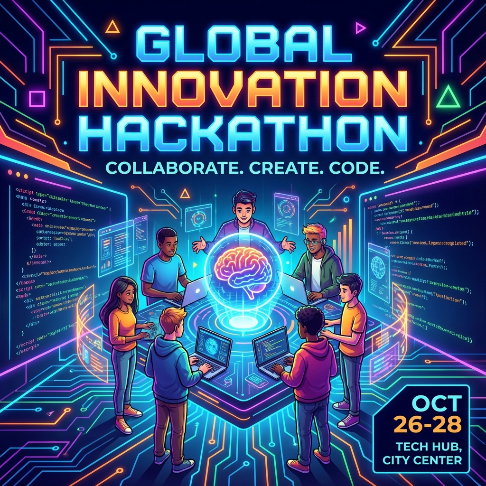

# 🌐 Skillsphere

Skillsphere is a full-stack web application built using the MERN stack. It provides a comprehensive platform for community interaction, featuring an anonymous chat system, event management tools, a user post system, and a dedicated admin dashboard for moderation.


## ✨ Features

- **🕵️‍♂️ Anonymous Chat**: A secure messaging environment where users can communicate freely in real-time without revealing their identities.
- **📅 Event Management**: Users can discover, create, and manage upcoming events, making it easy to coordinate community gatherings.
- **📝 Post System**: A fully functional feed where users can share thoughts, updates, and media.
- **🛡️ Admin Panel**: A centralized, secure dashboard for administrators to moderate content, manage users, and oversee platform activity.
- **🔐 Secure Authentication**: Robust user authentication and authorization utilizing JSON Web Tokens (JWT).
- **🌗 Dark / Light Mode**: A sleek interface supporting both dark and light modes for maximum accessibility and visual appeal.


## 🛠️ Tech Stack

### Frontend
- React.js
- Vite
- Framer Motion

### Backend & Database
- Node.js
- Express.js
- MongoDB
- Mongoose (Object Data Modeling)
- Socket.io (Real-time communication)

### Tools & Architecture
- RESTful API Architecture
- JWT (JSON Web Tokens) for security



## 🚀 Getting Started

Follow these instructions to set up the project locally on your machine.

### Prerequisites

Ensure you have the following installed:
- Node.js (v14 or higher)
- MongoDB (Local installation or MongoDB Atlas URI)

### 📁 Project Structure

```plaintext
skillsphere/
├── client/                 # React frontend
│   ├── public/
│   └── src/
│       ├── components/     # Reusable UI components
│       ├── pages/          # Page layouts
│       └── utils/          # Utilities and API setup
├── server/                 # Node.js/Express backend
│   ├── controllers/        # Route logic
│   ├── models/             # Mongoose schemas
│   ├── routes/             # API endpoints
│   └── middleware/         # Custom middleware
├── .env                    # Environment variables
└── package.json            # Project dependencies
```

## 🤝 Contributing

Contributions, issues, and feature requests are welcome! Feel free to check the issues page on GitHub if you want to contribute.
